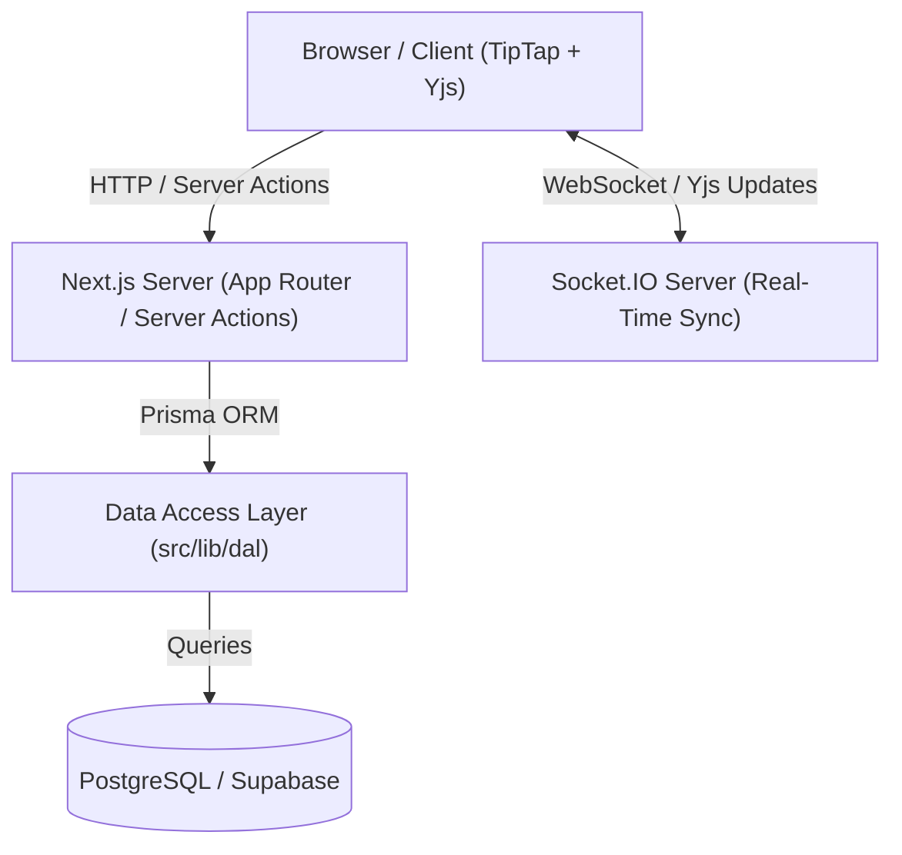

# Collaborative Document Editor — Frontend

[](https://nextjs.org/)
[](https://react.dev/)
[](https://www.typescriptlang.org/)
[](https://tailwindcss.com/)
[](https://playwright.dev/)
[](https://jestjs.io/)

A production-grade, real-time collaborative document editor built with **Next.js 16 (App Router)**, **React 19**, **TipTap**, **Yjs (CRDT)**, and **Socket.IO**. Designed for high performance, seamless multi-user co-editing, role-based authorization, and offline-first persistence via IndexedDB.

---

## 📋 Table of Contents

- [Overview](#-overview)
- [Key Features](#-key-features)
- [Tech Stack](#-tech-stack)
- [System Architecture](#-system-architecture)
- [Project Structure](#-project-structure)
- [Routes & API Specification](#-routes--api-specification)
- [Environment Variables](#-environment-variables)
- [Getting Started](#-getting-started)
- [Available Scripts](#-available-scripts)
- [Core Subsystems](#-core-subsystems)
  - [Authentication & Session Management](#authentication--session-management)
  - [Real-Time Collaboration (CRDT + Sockets)](#real-time-collaboration-crdt--sockets)
  - [Offline-First Sync & IndexedDB](#offline-first-sync--indexeddb)
  - [Role-Based Access Control & Sharing](#role-based-access-control--sharing)
- [Testing Suite](#-testing-suite)
- [CI/CD & GitHub Actions](#-cicd--github-actions)
- [Deployment Guide](#-deployment-guide)
- [Backend Repository & Integration](#-backend-repository--integration)

---

## 🌟 Overview

The **Collaborative Document Editor** frontend delivers a Google Docs-like real-time editing experience. It handles document lifecycle management, user authentication, live multi-user cursors/presence, conflict-free collaborative editing (CRDT), offline update queuing, and granular permissions (`OWNER`, `EDITOR`, `VIEWER`).

---

## ✨ Key Features

- **🔐 Authentication & Session Persistence:** Secure HTTP-only JWT session cookies managed via Next.js Server Actions and Middleware.
- **📄 Document Workspace:** Create, list, open, and manage documents with dynamic share token generation.
- **✏️ Rich Text Editor:** TipTap ProseMirror integration supporting typography, code blocks, highlighting, text alignment, and dynamic formatting toolbar.
- **⚡ Real-Time Co-Editing:** Conflict-Free Replicated Data Type (CRDT) synchronization via Yjs over Socket.IO connections.
- **👥 Collaborator Presence & Status:** Real-time online/offline presence indicators and active collaborator lists.
- **🛡️ Granular Access Control:** Role-based capabilities (`OWNER` and `EDITOR` can edit; `VIEWER` is read-only with contenteditable lock and toolbar suppression).
- **💾 Offline-First Architecture:** Local IndexedDB caching queues edits when connection is lost and flushes updates upon reconnecting.
- **👤 Profile Management:** Modal-based profile viewer accessible directly from the header.

---

## 🛠️ Tech Stack

| Domain              | Technology                                  | Description                                            |
| :-------------------| :------------------------------------------ | :----------------------------------------------------- |
| **Framework**       | Next.js 16 (App Router)                     | React 19, Server Components & Server Actions           |
| **Language**        | TypeScript 5                                | End-to-end static type safety                          |
| **Styling**         | Tailwind CSS v4                             | Utility-first styling with modern CSS features         |
| **Rich Text Editor**| TipTap / ProseMirror                        | Customizable headless rich text editor engine          |
| **Real-time Sync**  | Yjs, `y-prosemirror`, Socket.IO             | CRDT state management and WebSocket communication      |
| **Offline Storage** | IndexedDB (`idb`, `idb-keyval`)             | Local update persistence and offline queuing           |
| **Database & ORM**  | Prisma 7 / PostgreSQL / `@prisma/adapter-pg`| Server-side data access layer and DB schema            |
| **State & Fetching**| Zustand, React Query                        | Client state and server state management               |
| **Validation**      | Zod                                         | Schema validation for forms and payloads               |
| **UI Components**   | Lucide React, Sonner                        | Modern icons and toast notifications                   |
| **Testing**         | Jest, React Testing Library, Playwright     | Unit, integration, and E2E testing framework           |
| **CI/CD & Hosting** | GitHub Actions, Vercel                      | Automated build/test pipelines and edge deployment     |

---

## 🏗️ System Architecture

The application adopts a feature-driven, modular architecture where domain logic (API, services, hooks, components) is encapsulated within feature modules.



### Request & Data Flow
1. **Route Protection & Server Actions:** Browser requests pass through Next.js Server Actions (`useActionState`) and DAL modules for server-side auth validation and database interactions.
2. **Real-time Socket Protocol:** When entering a document workspace, the editor establishes a Socket.IO connection to `NEXT_PUBLIC_SOCKET_URL`, joining a document room.
3. **CRDT Collaboration:** Local document changes are encoded into Yjs binary update vectors and emitted over Socket.IO; incoming updates merge seamlessly into the local YDoc instance without cursor jumps or data loss.

---

## 📂 Project Structure

```text
├── e2e/                        # Playwright end-to-end tests & fixtures
│   ├── auth/                   # Authentication E2E specs
│   ├── collaborators/          # Real-time collaboration & presence specs
│   └── fixtures/               # Test context & page fixtures
├── src/
│   ├── app/                    # Next.js App Router pages & API routes
│   │   ├── (auth)/             # Login & Registration pages
│   │   ├── (documents)/        # Documents workspace & Editor pages
│   │   └── api/                # API endpoints & proxy routes
│   ├── features/               # Feature-based domain modules
│   │   ├── auth/               # Auth validations, services, and actions
│   │   ├── collaborators/      # Collaborator management & presence
│   │   ├── docEditor/          # TipTap editor, Yjs provider & Socket integration
│   │   ├── docs/               # Document CRUD components, actions & services
│   │   └── user/               # User profile components & actions
│   ├── lib/                    # Core utilities & server libs
│   │   ├── auth/               # Session encryption/decryption (jose JWT)
│   │   ├── browser-storage/    # IndexedDB Yjs offline storage
│   │   ├── dal/                # Server-side Data Access Layer
│   │   ├── db/                 # Prisma client instance
│   │   └── realtime-updates/   # Socket.IO client setup & event handlers
│   ├── shared/                 # Shared UI primitives, constants, & utilities
│   └── store/                  # Zustand global state stores
├── tests/
│   ├── integration/            # Jest integration tests
│   └── unit/                   # Jest unit test suites for components & libs
├── package.json
└── playwright.config.ts
```

---

## 🌐 Routes & API Specification

### Application Routes

| Path | Access Level | Description |
| :--- | :--- | :--- |
| `/` | Public | Home / Root landing, redirects to `/login` |
| `/login` | Public | User authentication page |
| `/register` | Public | User registration page |
| `/documents` | Protected | User document dashboard & document listing |
| `/create-document` | Protected | Document creation form |
| `/documents/[id]/[documentToken]` | Protected | Real-time collaborative document editor workspace |

### Primary Server Actions & API Endpoints

- `POST /auth/register` — User account creation.
- `POST /auth/login` — Session initiation and JWT cookie issuance.
- `POST /user/logout` — Session termination and cookie invalidation.
- `GET /documents` — Retrieval of user-owned and shared documents.
- `POST /documents/create` — Document creation with initial access rights.
- `GET /documents/[id]` — Workspace initialization and token verification.

---

## ⚙️ Environment Variables

Copy `.env.example` (or set up environment files at the root level):

```bash
# .env.development (Used by pnpm dev / npm run dev)
NEXT_PUBLIC_APP_ENV=development
NEXT_PUBLIC_API_URL=http://localhost:3000/api
NEXT_PUBLIC_SOCKET_URL=http://localhost:8000
DATABASE_URL=postgresql
SESSION_SECRET=your-super-secret-session-key

# .env.testing (Used by E2E and Jest tests)
NEXT_PUBLIC_APP_ENV=testing
PORT=3000
NEXT_PUBLIC_BASE_URL=http://localhost:3000
NEXT_PUBLIC_API_URL=http://localhost:3000/api
NEXT_PUBLIC_SOCKET_URL=http://localhost:8000
SESSION_SECRET=testing-secret-key

# .env.production (Used for deployment)
NEXT_PUBLIC_APP_ENV=production
NEXT_PUBLIC_API_URL=
NEXT_PUBLIC_SOCKET_URL=
DATABASE_URL=postgresql
SESSION_SECRET=your-production-secret-key
```

---

## 🚀 Getting Started

### Prerequisites

- **Node.js**: `v22.x` or higher
- **Package Manager**: `pnpm` (recommended (version should be greater than or equal to 11.14.0)) or `npm`
- **Database**: PostgreSQL instance (local or remote)
- **Socket Backend**: Running Socket.IO backend instance

### Installation & Setup

1. **Clone Repository:**
   ```bash
   git clone https://github.com/roshidhmohammed/colloborative-doc-editor-full-stack.git
   cd collaborative-doc-editor-frontend
   ```

2. **Install Dependencies:**
   ```bash
   pnpm install
   # or
   npm install
   ```

3. **Configure Database Schema:**
   ```bash
   pnpm prisma generate
   pnpm prisma db push
   ```

4. **Start Development Server:**
   ```bash
   pnpm dev
   # or
   npm run dev
   ```
   Navigate to [http://localhost:3000](http://localhost:3000).

---

## 📜 Available Scripts

| Command | Description |
| :--- | :--- |
| `pnpm dev` | Starts Next.js development server |
| `pnpm build` | Compiles production application bundle |
| `pnpm start` | Launches production build server |
| `pnpm lint` | Runs ESLint analysis across codebase |
| `pnpm test:unit` | Runs unit test suite via Jest |
| `pnpm test:watch` | Runs Jest unit tests in interactive watch mode |
| `pnpm test:coverage` | Generates Jest unit test code coverage reports |
| `pnpm test:integration` | Runs integration tests |
| `pnpm test:e2e` | Executes Playwright end-to-end test suite |
| `pnpm test:e2e:ui` | Launches Playwright interactive UI test runner |
| `pnpm test:e2e:headed` | Runs Playwright E2E tests in visible browser windows |

---

## 🧠 Core Subsystems

### Authentication & Session Management
- Authentication relies on **HTTP-only, SameSite cookies** encrypted using `jose` JWTs.
- Server-side Data Access Layer (`src/lib/dal`) verifies sessions before rendering protected routes.
- Automatic redirection occurs for unauthenticated visitors or authenticated users navigating to auth pages.

### Real-Time Collaboration (CRDT + Sockets)
- Document states are tracked as **Yjs Y.Doc** instances.
- TipTap ProseMirror binds directly to Yjs via `y-prosemirror` and `@tiptap/extension-collaboration`.
- Changes are transmitted via Socket.IO events (`document:join`, `document:update`, `document:leave`).
- Offline updates or late-joining clients automatically synchronize state using CRDT delta merges.

### Offline-First Sync & IndexedDB
- Local changes persist to IndexedDB (`document-editor-db`) via `idb` and `idb-keyval`.
- Network state shifts seamlessly toggle between local buffer and remote WebSocket broadcast.

### Role-Based Access Control & Sharing
- Share tokens represent specific access levels (`EDITOR` or `VIEWER`).
- `VIEWER` permissions enforce `contenteditable="false"` on the ProseMirror container and unmount editing toolbars.

---

## 🧪 Testing Suite

### Unit Testing (Jest)
Tests cover individual component rendering, state stores, hooks, schema validations, and utility functions located under `tests/unit`.
```bash
pnpm test:unit
```

### Integration Testing (Jest)
Tests validate full request and data access lifecycles across server actions, session management, Prisma database operations, document record creation, and collaborator permission assignments located under `tests/integration`.
```bash
pnpm test:integration
# or run in interactive watch mode
pnpm test:integration:watch
```

### End-to-End Testing (Playwright)
Validates end-to-end user workflows including authentication redirects, multi-user co-editing, viewer/editor role boundaries, share links, and real-time collaborator presence indicators located under `e2e`.
```bash
pnpm test:e2e
```

---

## 🔄 CI/CD & GitHub Actions

Automated GitHub Actions workflows run on push and pull requests:
1. **Lint & Type Check:** Verifies TypeScript strict compliance and ESLint rules.
2. **Unit Tests:** Executes full Jest suite with coverage tracking.
3. **E2E Tests:** Launches headless Playwright browsers against test server environment.
4. **Automated Deployment:** Deploys successful `main` branch builds to Vercel.

---

## 🚢 Deployment Guide (Vercel)

1. Connect repository to **Vercel**.
2. Configure **Environment Variables** (`NEXT_PUBLIC_API_URL`, `NEXT_PUBLIC_SOCKET_URL`, `DATABASE_URL`, `SESSION_SECRET`).
3. Set build command to `pnpm build` and output framework to **Next.js**.
4. Deploy application.

---

## 🔗 Backend Repository & Integration

This frontend communicates with the companion Socket.IO and REST API backend:
- **Backend GitHub Repo:** [roshidhmohammed/colloborative-doc-editor-backend](https://github.com/roshidhmohammed/colloborative-doc-editor-backend)
